<a id='Top'></a>
# IBM Applied Data Science Capstone Project
## Week 5 Report

### Project Title: Clustering for Similarities in NYC & Toronto<br><br>
#### Table of Contents
1. [Introduction & Problem Statement](#PartOne)
2. [Data Acquisition & Preparation](#PartTwo)
3. [Methodology & EDA](#PartThree)
4. [Results & Discussion](#PartFour)
3. [Conclusion](#PartFive)

<a id='PartOne'></a>
****
#### 1. Introduction & Problem Statement
****

##### 1.1 Introduction
During this long voyage through IBM's Professional Certificate track, we've learned so much about the whole notion of using the data all around us to create stories and say something meaningful with them. This is my attempt at exactly that.
In this Capstone Project, we will try and visualize, in different ways while using different techniques, the similarities between NYC and Toronto.
New York City (NYC) is one of the most populous cities in the USA, having a wide range of diversity, be it cultural or otherwise. Also, we are looking at one of the most powerful states, in economic terms. Besides her ilustrious fame, acquired with the exposure in so many mediums (TV shows, movies, etc), her beauty makes her one of the most visited places in the world, for the past several years. In Nyc we have five (5) boroughs: Manhattan, Staten Island, Queens, Brooklyn and the Bronx.
Toronto shares many of NYC's characteristics, from the get-go. Also, the most populous city in Canada, as well as being one of it's most powerful centers for businesses, manufacturing etc. Here, in Toronto, things might be a lot more toned down compared to NYC, but it's beauty is still there for travellers to enjoy.

##### 1.2 Problem Statement
Using data wragling techniques and location data we will study, analyze, cluster and compare the neighbourhoods of NYC and Toronto. We will dive headlong into the data at hand, using most of the techniques passed on to us throughout this course and try to see the similarities between the two cities. <br>
The provided analysis and conclusion will give a better understanding to anyone interested, be it a business enthusiast, an avid traveller or just a data fan, as to what makes these two cities "identical" (may be a strong word!), or "unique"!
We will be using our newfound techniques in order to see whether these two cities, NYC and Toronto, have similarities betwenn their Neighbourhoods. This will provide insights that can be applied in various situations. <br>
If we're looking at this from a business perspective, let's say we have a successful business in either one cities neighbourhood; using these tools, we can get a first glance at some potential candidate locations in the other city.<br>
The same principles can be applied even if we are just travellers, students, employees or anything for that matter, just looking how to manage a city transition between these two. Nothing feels better than home, but if, say, we have to move from NYC to Toronto (or vice versa) this can help make this big change more tolerable. <br>
I hope you enjoy our journey!
<br><br><br>
[Back to top](#Top)

<a id='PartTwo'></a>
*****
#### 2. Data Acquisition & Preparation
*****

##### 2.1 Data Acquisition
We have in our disposal two basic data structures to handle; the first being our 'Neighbourhood Data' and the second, our 'Venues Data'.
- **A. Neighbourhood Data**
<br>
<i> Example location data in json format</i>

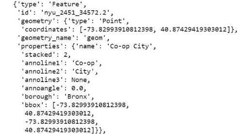
The datasets used for our two cities came from two (2) different sources; for NYC, they were provided by the staff of IBM's "Data Science Professional Certificate" and for Toronto, internet scraping was used. For both, the data acquired consist of major, albeit basic, information such as Neighbourhood, Borough, Latitude and Longitude coordinates.
- **B. Venues Data**

Here we used FourSquare's API to obtain information about the venues in our cities' neighbourhoods. They consist of many different information fields, but using the right code parameters, we got just the needed fields. FourSquare is one of the largest location and venue data sources and their API was utilized to demonstrate our project idea.<br>
<i> Example of the returned venues data, before any manipulation </i><br>

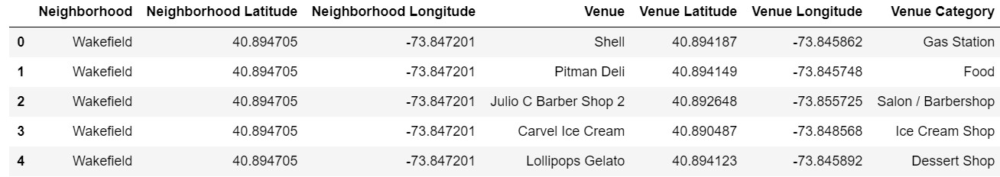
<br><br><br>
[Back to top](#Top)

##### 2.2 Data Preparation


**A. Neighbourhood data**  
 - ***New York City***  
 As stated above, the dataset for NYC's neighbourhoods were provided by the course's staff. It came in a <i>.json</i> format file, with all the required information we need to divide up the city by it's inner territories. Storing the data in a <i>Panda's Dataframe</i> with the the needed data wrangling techniques, gave us the desired result. With the final data at hand, we are now able to "explore" NYC's neighbourhoods, at least in a basic, for now, way.
 
<i> Example of the NYC data with coords </i><br>
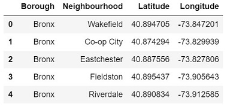

 
 - ***Toronto***  
 For Toronto, we had to get our hands more "dirty", in order to compile the desired data structure. The information was provided via the Wikipedia page for Toronto's neighbourhoods ([wiki link](https://en.wikipedia.org/w/index.php?title=List_of_postal_codes_of_Canada:_M&oldid=942851379)), but on an earlier version state than the current, because of the data format used now on the wiki page, being incompatible for scraping <i>(or at least our current techniques!)</i>. This came, as epected, in <i>.html</i> format. Next, using a dataset provided yet again by the course's staff containing each of Toronto's neighbourhood' corresponding Post Code along with their respective lat/lng coordinates, in <i>.csv</i> format. Combining the two sets with the proper parameters and cleaning, the desired data structure was at our disposal.<br>
 
<i> Example of the Toronto data with coords </i><br>
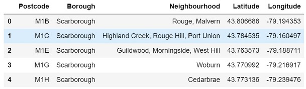
<br><br><br>
[Back to top](#Top)

**A. Venues data**  

The FourSquare API provided us with a large amount of venue information about our two cities. With the proper keys to use this API (as most API's need nowadays), and the right code to "hit" those calls succesfully towards the API, we gathered our information.
Retrieving data and then going through all the notions to get them in the format that is needed can be a long and arduous procedure. Here comes the power of Python and its Object Oriented nature. We were able to combine the knowledge and techniques acquired through the entire specialization, in order to define 3 major functions in our code, that ultimately gave us the ability to reach our end-goal with as little as 1 line of code!


<i>The final piece of one-line code, calling all the internal functions</i><br>
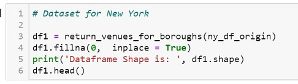

In further detail, first we defined the proper way to "talk" to FourSquare <i>(function get_near_by_venues)</i> and retrieve the basic data for our Venues, Venue Name & Category and lat/lng coordinates, in respect to their neighbourhoods.


<i>the 1st function in line, gets us the venue data</i>
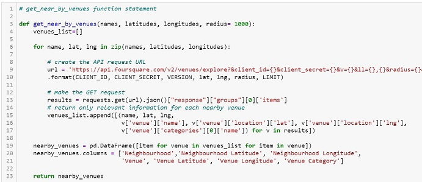

Then, defining our one-hot encoding techniques and data normalization, the data now are grouped and transformed in a way that is easier for us to understand and manipulate further. <i>(functions explore_borough and return_venues_for_boroughs)</i>


<i>The 2 next pieces of predefined code functions, completing our functions</i>
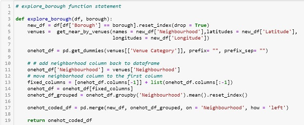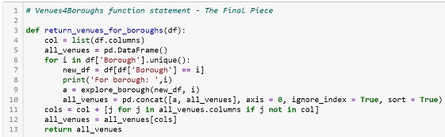


Finally, both datasets were in a format that was not just aligned to one another, but also provided useful information, again, within a few lines of code and the backing power of Python and Object Oriented Programming Design, with the use of functions to be used generally and on the spot.
 
 
<i>Our returned data, with a simple line of code</i>
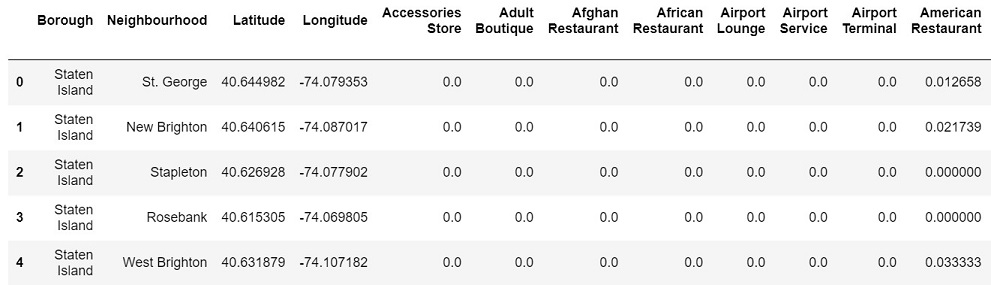
 
This is our first, brave step, towards our end-goal.    
Getting our idea, around the data provided around us, then using the proper skillset and techniques, <i>(also provided abundantely with the fine example of IBM's courses)</i>, in order to have that idea tell a story.  
A Digital Story of a Data Scientist.
<br><br><br>
[Back to top](#Top)

<a id='PartThree'></a>
****
#### 3. Methodology & EDA
****

#### 3.1 Methodology
<br>
In this section we'll discuss the Methods used in order to achieve the end-goal. <br>
First of all, we needed to have our two datasets in a similar structure. That is because of the amount of values returned for each city/neighbourhood for Venues. <br><br>
<i> Quick glance at the initial dataframes shapes</i><br>
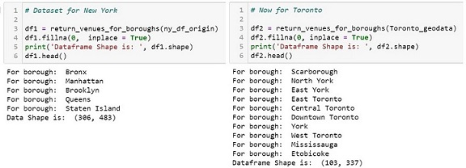


Having roughly **480** venues for NYC and **340** for Toronto, it's clear that direct comparisons would be hard to achieve accurate results.<br>
Thus, we applied the following:<br>
Using data manipulation techniques in order to group our results in a more consice way, first we used one-hot encoding, in order to have a common variable to compare between values (Venues) in both datasets.<br>
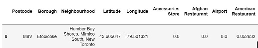<br>
As shown above, the values in each row (Neighbourhood) now are in a scale of 0 to 1, representing the mean value of them all.<br>
This enabled us to achieve an even more consice way to represent our data, with an ordered way. Meaning, we could easily extract the Top10 Venues per Neighbourhood.<br><br>
<i> Example of the Top10 Tables for each City</i><br>
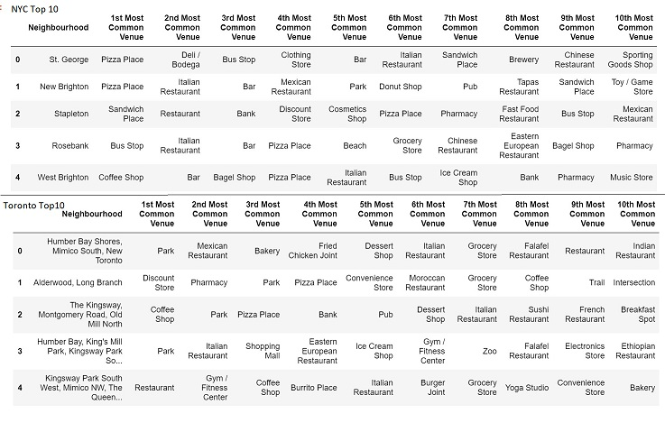<br>
This enables us to use each data set for further, simpler comparison between them. Also, we can explore both sets individually to get more information for each Neighbourhood and bring everything together at the end, with a more impactfull way.

#### Further Analysis on individual City data

We used K-Means Clustering in order to provide more meaningful information about each City and their respective Neighbourhoods. We were able to group together Neighbourhoods with similar venue-structures and this gives us a first glance that things start to come together.<br>
Also, a visual representation of the above method, also serves the purpose to get the message across.<br>
<br>
<i>NYC Map with visual Clusters</i><br>
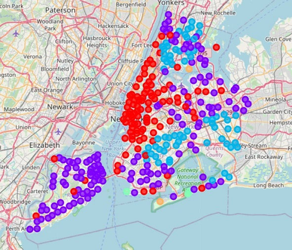<br>
<br>
<i>Toronto Map with visual Clusters</i><br>
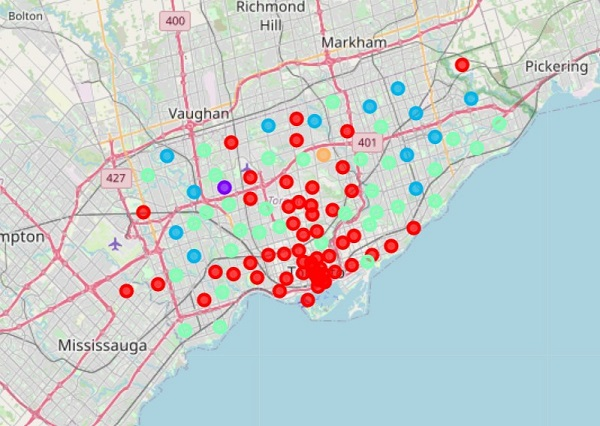<br>
<br><br><br>
[Back to top](#Top)

#### 3.2 EDA

As we dive deeper into the data presented, we can start to present more visual aids to explore further on.<br>
###### Note:
<i> As this project was executed during the time of the pandemic of COVID-19, and effectivelly, a global lockdown, the  results can be recalculated and further analyzed at a later time, to provide more insights</i>

* Here, we can see how many Venues per category, in pure numbers, exist in our cities.<br><br>
<i> NYC Most Common Venues</i>
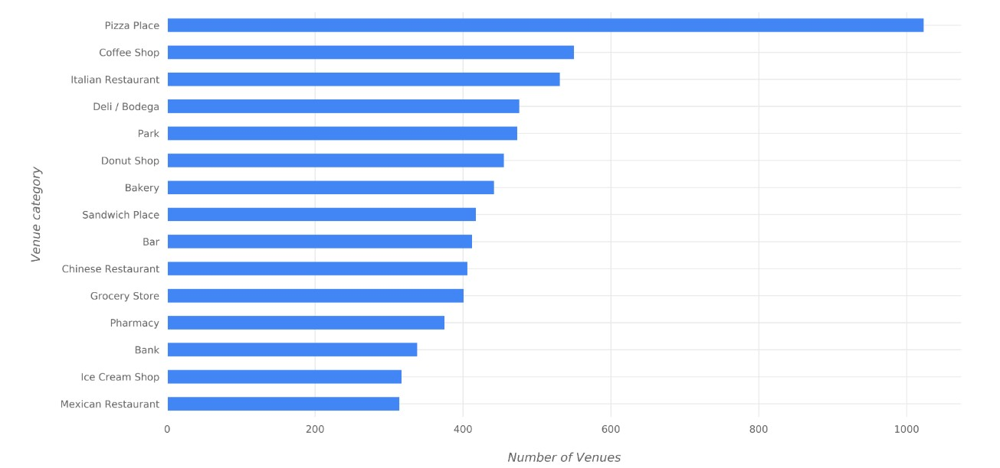<br>
<br>
<i> Toronto Most Common Venues</i>
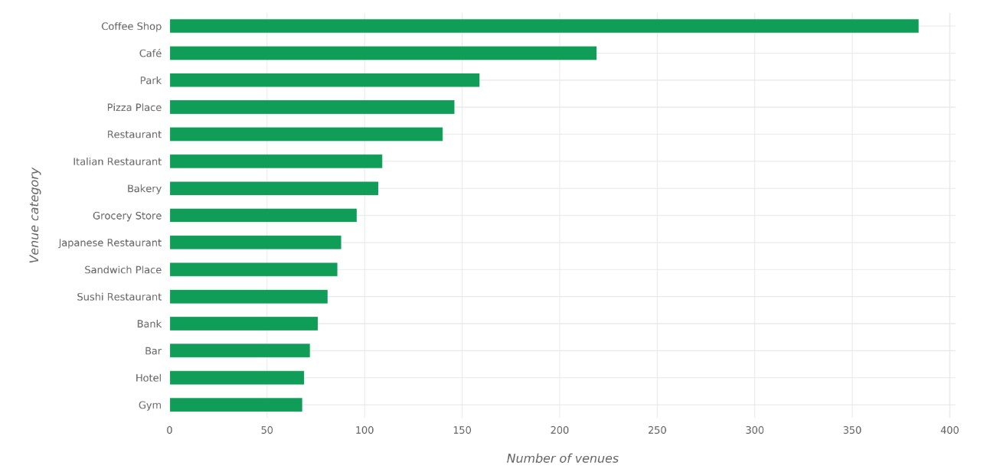<br><br>

* Below we can see in how many Neighbourhoods each Venue category is found.<br><br>
<i> NYC Most Common Venues Neighbourhood appearance</i>
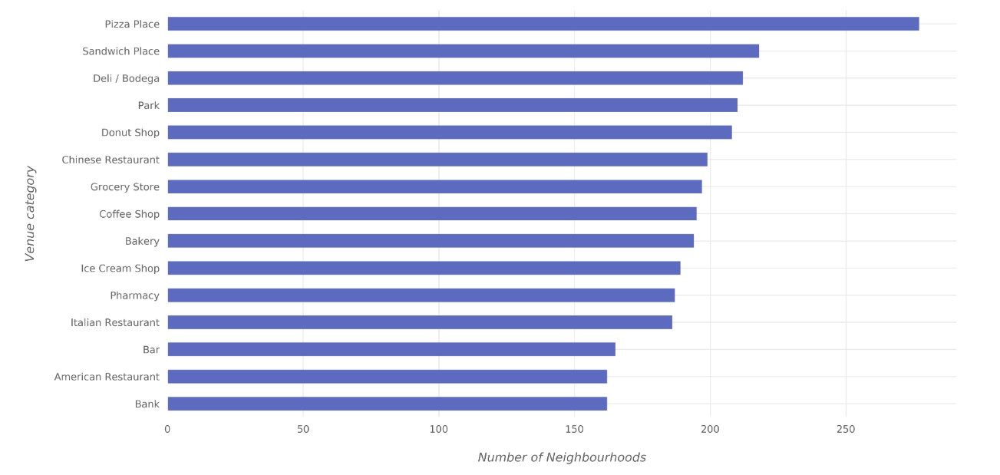<br>
<br>
<i> Toronto Most Common Venues Neighbourhood appearance</i>
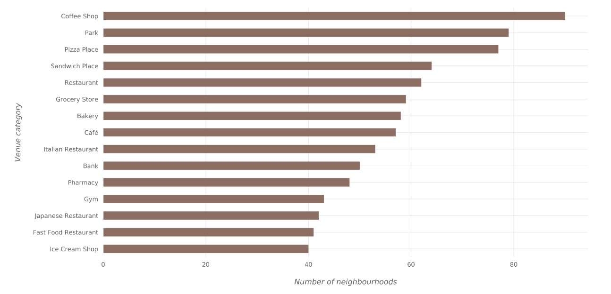<br><br>

* Following the same direction, let's visualize the top Venues for both cities, combined.<br><br>
<i> NYC & Toronto Most Common Venues</i>
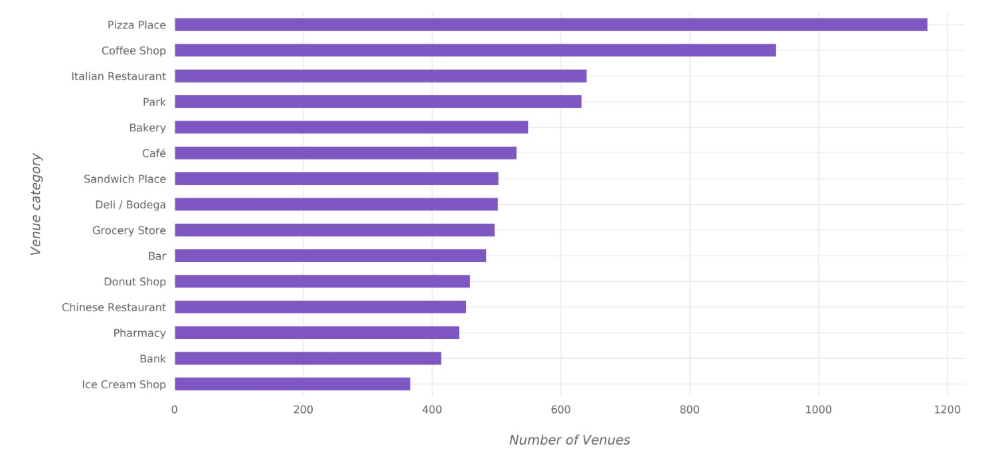<br>
<br><br>
[Back to top](#Top)

<a id='PartFour'></a>
****
#### 4. Results & Discussion
****

#### 4.1 Results<br>
******
**Note:**<br>
<i>As we approach the subject more and more, it's apparend that the impact from the current global lockdown due to the pandemic is messing with our data. <br>
Well, to be more precise, and honest towards the data, they are actually showing us the 'current image' of the two cities, thus being more aligned with the times we are going through.<br>
There is a strong urge to follow up this analysis when we are, once again, in a more 'normal' day-to-day life-cycle, as  a whole.</i>
*****
<br><br>
Other than that, using everything we have so far, we can, finally, combine our two sets, with their Top10 Venues and cluster them all together to really get the idea of how similar (or not!) our two cities neighbourhoods' are.

* Using K-Means clustering techniques, we have our now complete data set from both cities and their clustering, as shown below. <br>
<i>The Neighbourhoods can be destinquished from their suffix.</i><br><br>
<i> Example of the combined and structured data set</i><br>
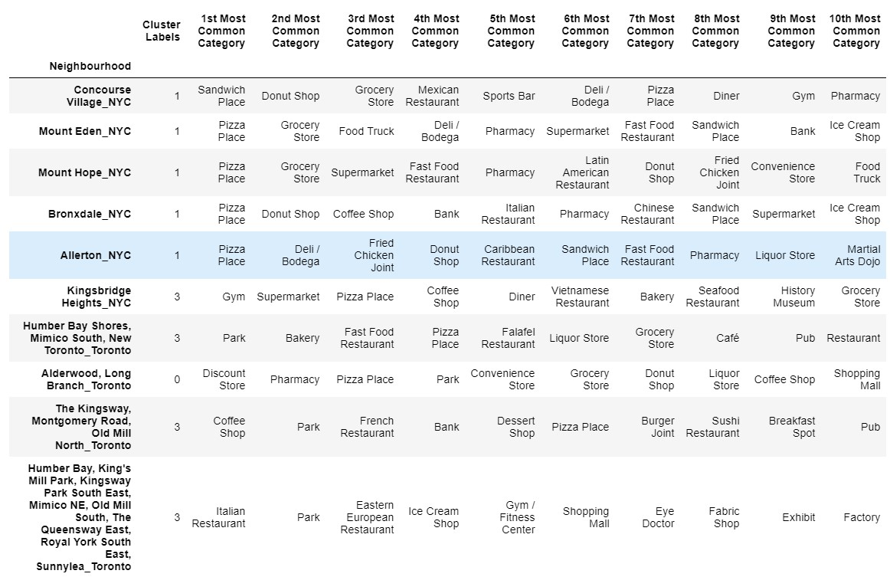<br>

* Below is a graphical presentation of the Clusters and their Neighbourhoods from each city.<br><br>
<i> Bar Chart on the Clusters and the Neighbourhood per City distribution</i><br>
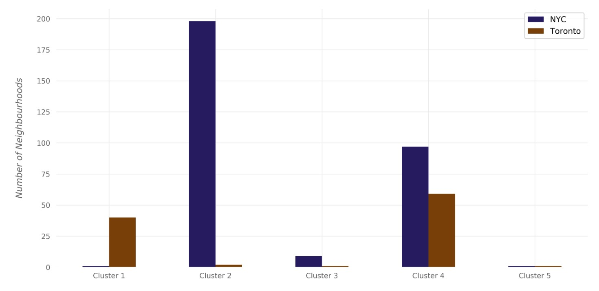<br>

#### 4.2 Discussion<br>

Let's take a closer look at the distributed Venues per Cluster.<br><br>
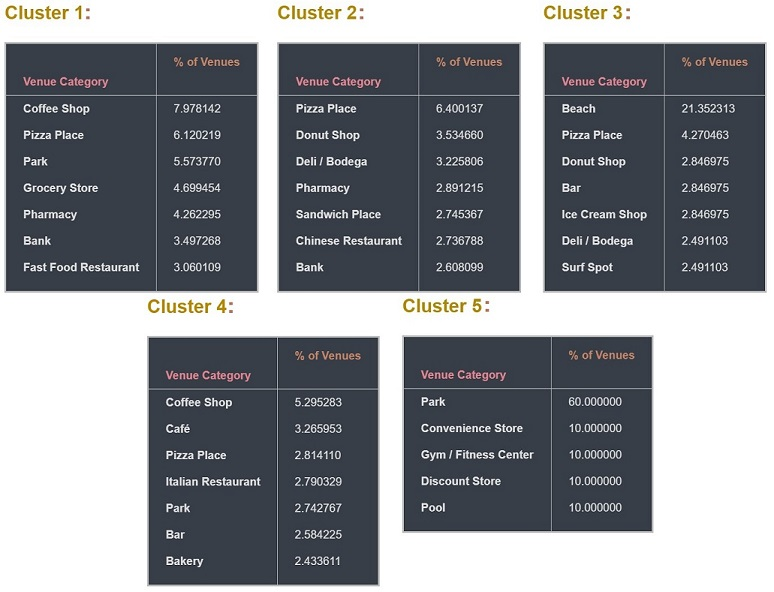<br>

As we can easily pinpoint from the above table sets, the current status quo has indeed been the main ingredient of our data results.<br>
There are some basic groups of Venue Categories, spread throughout our Neighbourhoods, but also, in a disctinct way between the Clusters.<br>
This can be interpreted as the current day-to-day life in those Clusters/Neighbourhoods, and what their residents have available to visit at this time.<br>
There is the case of Cluster 5 as well, which is compromised entirelly by the current state of affairs.<br><br>
I have the need to state once again that this analysis and approach will get entirelly different results if performed at a later time. Such an action is already in our plans, to get further insights on the "next day" after the lockdown.
<br><br>
[Back to top](#Top)

<a id='PartFive'></a>
****
#### 5. Conclusion
****

The basic notion of this endeavour was to find similarities between the Neighbourhoods of New York City and Toronto.<br>
I believe that this has been achieved.<br>
Now, it is entirelly different to "achieve" the afformentioned end-goal and to actually see meaningfull information from the former.<br> 
It is one thing to have ones work, methods, code applied successfully in a topic and a totally different thing for it's results to have impact.<br>
In a sense, for the writer, both have been achieved. This has been a journey like no other, trying to make code to do all the above tasks, and perform as expected.

It is clear that there are in fact similarities between our two cities Neighbourhoods, and we will continue to peruse this project with regular updates as the world inches away from this state.<br>
The idea of someone using this tool is still valid, for business perpuses or personal, academic or otherwise.<br>
We can see the picture forming there and the idea of expanding, and perhaps automating, such a look through two cities and their Neighbourhoods is very much appealing.<br>
<br>
This has been a great journey, I hope to see you again, on the next one!<br><br>
Stay Safe!
<br><br>
[Back to top](#Top)


```python

```
